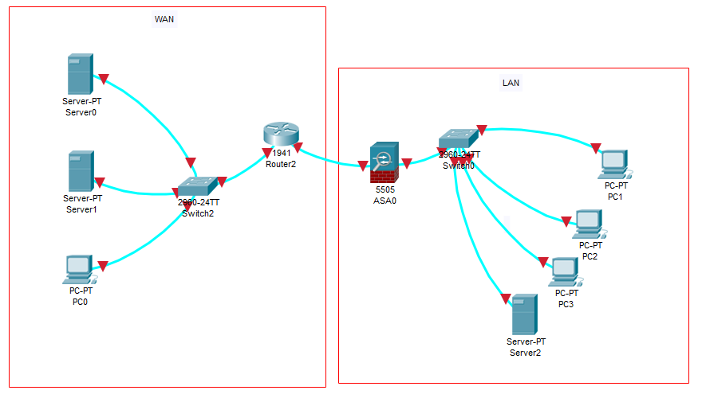

# Lab 1 : construction d'un réseau simple et démarrage

## Environnement de travail

Packet tracer

## Le contexte

Cela pourrait être le réseau d'une petite PME ou d'une agence :

- Quelques PC
- Un serveur
- Un switch raccordant le tout
- Un parefeu
- Un routeur opérateur
- Des ressources accessibles sur Internet

## Les besoins

Sur un réseau de ce type, les besoins sont souvent simples :

- Attribuer des adresses IP aux postes de travail
- Permettre aux postes de travail de communiquer avec le serveur (partage de fichiers, etc...)
- Accéder à Internet de manière sécurisée

## La réponse au besoin

Le réseau est très simple :

- Un switch 2960 fournit les services LAN
- Sur ce LAN se trouve 3 postes de travail et un serveur
- Ce switch est raccordé à un parefeu ASA sécurisant la connexion Internet
- L'ASA est raccordé à un routeur 1941, qui est le routeur opérateur (routeur CPE) qui fournit l'accès fibre à Internet
- La partie Internet est simulée avec les équipements
  - Un switch
  - Deux serveurs
  - Un PC

## La configuration

Le LAN est un LAN plat (pas de VLAN, pas de cloisonnement) sur le sous-réseau 192.168.0.0/24.
Le client a demandé :

- 32 IPs fixes
- un pool DHCP pour 128 machines

La connexion Internet est une connexion FO fournie par un opérateur.
Les informations données par l'opérateur sont les suivantes :

- Sous-réseau : 190.250.122.40
- Plage : 40 à 47
- Broadcast : 47
- Routeur opérateur : 46
- Masque : 255.255.255.248
- DNS : 194.2.0.20, 194.2.0.50

## Le projet dont vous êtes responsable

Vous êtes responsable du projet d'installation de l'ensemble :

- Définir la configuration réseau
  - Découpage de l'espace d'adressage
  - Nommage des équipements
  - Définition du routage vers Internet
- Mettre en route les équipements
  - Câblage
  - Accès aux équipements
  - Mise à jour des firmwares
  - Sauvegarde de la configuration
  - Accès administrateurs aux équipements
- Configuration du réseau
  - Mise en place du DHCP en local
  - Mise en place de l'accès Internet
  - Filtrage du trafic Internet

Nous sommes mardi matin. Vous êtes devant une pile de cartons contenant les équipements et les câbles. Vous devez avoir terminé la configuration si possible dans la journée, certainement dans la semaine.

## Suite du projet

Nous réalisons une [étude préalable](lab1etudeprealable.md) du projet.